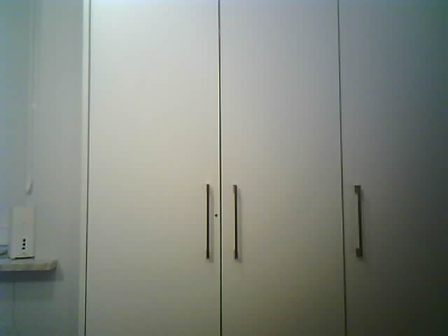
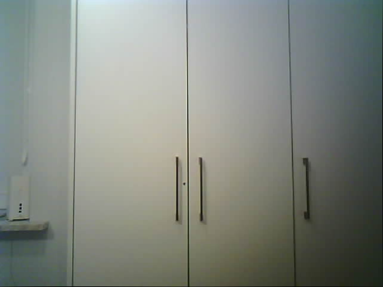
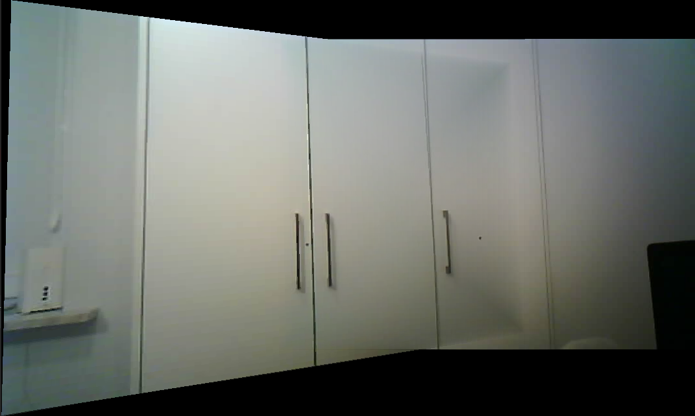
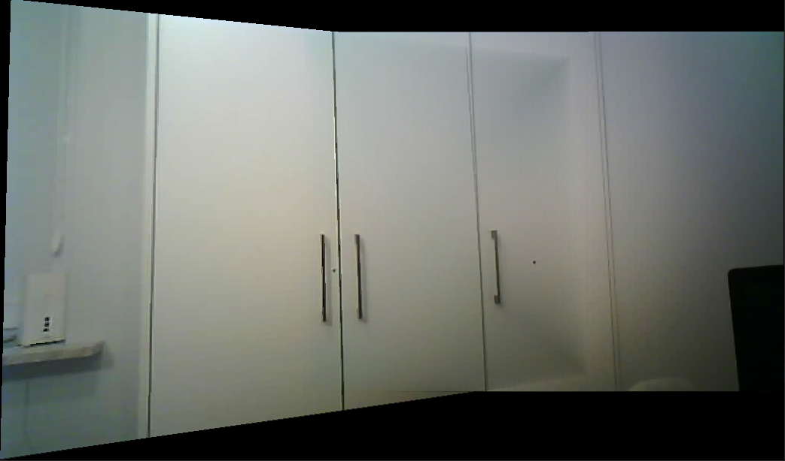

# Image Stitching
Although there are multiple implementations of image stitching using different libraries (OpenCV, skimage, ...) this repository contains image stitching using only `numpy` for computations and `cv2` for displaying images. Both projective transformation fitting and RANSAC are implemented using `numpy`, but the undistortion is done using `cv2` library.

## Repository Contents
There are 2 example photos already present in distorted and undistorted form: `examples/distorted000.png`, `examples/undistorted000.png`, `examples/distorted001.png`, `examples/undistorted001.png`:

Example 000:




Example 001:


If you wish to take your own photos using ESP32-CAM you can capture them using `image_capture.py` script. You can take a screenshot with the space bar.
The repository also contains `examples/matching_points_000_001.txt` - 5 pairs of matching keypoints between images `examples/undistorted000.png` and `examples/undistorted001.png` picked by hand.

Contents of `examples/matching_points_000_001.txt`:
```
295 264 25 272
295 368 27 385
335 266 72 271
336 369 76 381
507 265 251 266
```

## How To Run The Code
To setup the environment it is recommended to create a virtual environment in this directory:
```bash
python -m venv venv
```
Activate the virtual environment and install required dependencies:
```bash
. venv/bin/activate
pip install -r requirements.txt
```
There are 2 main scripts that can be executed:
1. Run `python stitch_using_points.py <path_to_img1> <path_to_img2> <path_to_points_file>` to generate a stitched image from 2 given images using hand-picked matching keypoints. You can simply run `python stitch_using_points.py` to use example images. Sample panorama generated by this script `examples/panorama_task_5.png`:


2. Run `python stitch.py <path_to_img1> <path_to_img2>` to generate a stitched image from 2 given images using automatically picked matching keypoints. You can simply run `python stitch.py` to use example images. Sample panorama generated by this script `examples/panorama_task_7.png`:


## Running Tests
Execute:
```bash
pytest .
```